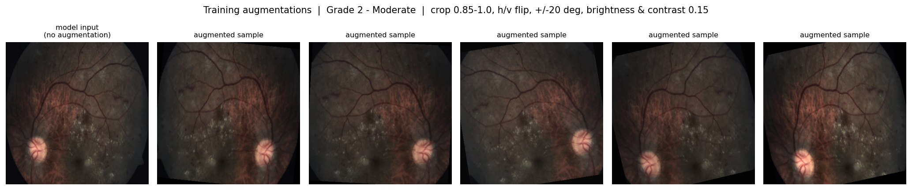
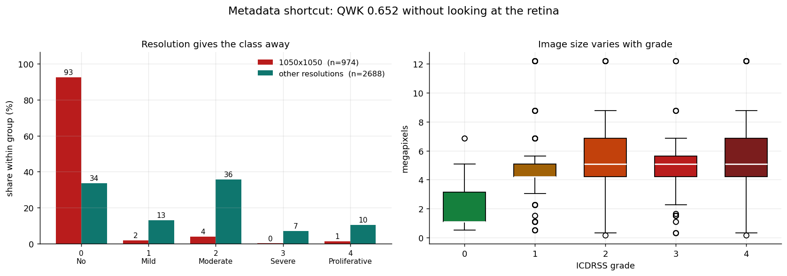

# APTOS-2019 Diabetic Retinopathy Grading

Final-year data science project. Predicting diabetic retinopathy severity
(ICDRSS grades 0-4) from 3662 retinal fundus photographs.

Data: Kaggle [`mariaherrerot/aptos2019`](https://www.kaggle.com/datasets/mariaherrerot/aptos2019)
— the APTOS 2019 Blindness Detection set, pre-split into train/valid/test.

## Architecture

| Layer | Location |
|---|---|
| Labels and results | BigQuery `datascientis.APTOS_2019` |
| Images (shared) | GCS `gs://aptos2019-retina-images` |
| Images (training) | `data/processed*/` — 512px JPEG, local |

Colab and a local GPU read the same BigQuery tables and the same bucket. Every
run is written with `run_id`, `author`, `variant`, `seed` and `fold`, so runs
never overwrite each other.

## Setup

```bash
pip install -r requirements.txt
```

For GPU support install PyTorch from the CUDA index **only** — adding
`--extra-index-url` makes pip prefer the CPU build on PyPI:

```bash
pip install --force-reinstall torch torchvision --index-url https://download.pytorch.org/whl/cu128
```

Authentication:

```bash
export GOOGLE_APPLICATION_CREDENTIALS=/path/to/service-account.json
```

## Pipeline

```bash
# 1. Raw data
kaggle datasets download mariaherrerot/aptos2019 -p data/images --unzip

# 2. Labels -> BigQuery
python scripts/prepare_bq_csv.py
python scripts/load_to_bigquery.py --project datascientis --dataset APTOS_2019 \
       --location EU --prefix aptos_

# 3. Scan image properties -> BigQuery
python scripts/scan_images.py

# 4. Reports: image properties, data quality, shortcut analysis
python scripts/image_report.py
python scripts/quality_report.py
python scripts/confound_analysis.py

# 5. Prepare images for training
python scripts/preprocess_images.py --size 512              # with CLAHE
python scripts/preprocess_images.py --size 512 --no-clahe   # control set

# 6. Figures
python scripts/make_figures.py

# 7. Train - single split
python scripts/train.py --mode reg --epochs 30 --patience 5 \
       --data-dir data/processed_clahe --variant clahe --exclude-leaked

# 7b. Train - 5-fold cross-validation (preferred)
python scripts/train_cv.py --folds 5 --exclude-leaked --variant baseline

# 8. Compare runs
python scripts/analyze_runs.py
```

## Preprocessing

Shared functions live in `scripts/preprocessing.py`; every other script and the
Colab notebook imports from it rather than keeping a copy.

```
Read -> Quality check -> Auto-crop -> CLAHE -> Square -> Resize -> Normalise
```


| function | what it does |
|---|---|
| `auto_crop()` | Removes the black frame outside the retina (10.4% of the area on average) |
| `apply_clahe()` | CLAHE on the LAB L channel only, so colour balance is preserved |
| `to_square()` | `squash` or `pad`; squash cuts black area from 28.5% to 13.4% |
| `image_quality()` | Brightness and contrast measures, unusable-image detection |
| `brightness_outliers()` | MAD-based outlier detection |
| `dhash()` | Perceptual hash, used as a duplicate candidate generator |
| `preprocess()` | The full six-stage pipeline |

**Order matters.** CLAHE must run *after* `auto_crop`: on an uncropped image the
wide black border skews the histogram. Normalisation happens in the torchvision
transforms at training time, not in the pipeline — keeping it in one place
avoids normalising twice.

Each processed directory carries a `_manifest.json` recording the settings that
produced it, and the training scripts print it, so every run states which
preprocessing it used.

## Data

3662 images, all readable, all three-channel RGB.


The classes are heavily imbalanced — 1434 No DR against 154 Severe in training,
a ratio of 9.3:


Resolution varies widely: 17 distinct sizes between 474x358 and 4288x2848, the
most common being 1050x1050 (974 images).


Detailed reports: [`reports/image_properties.md`](reports/image_properties.md),
[`reports/data_quality.md`](reports/data_quality.md),
[`reports/confounds_and_noise.md`](reports/confounds_and_noise.md).

## Model and training

EfficientNet-B0 with ImageNet weights, 384px input.

**Augmentation.** Random resized crop (0.85-1.0), horizontal *and vertical*
flip, +/-20 degree rotation, mild brightness and contrast jitter. Vertical flip
is included because a fundus photograph has no meaningful up/down orientation.
Colour jitter is kept mild: large shifts would fight CLAHE, which normalises
local contrast on purpose.



**Loss.** Two modes, selected with `--mode`:

- `reg` — single output with MSE, and four thresholds tuned on validation to map
  the continuous prediction onto grades 0-4
- `cls` — five-way softmax with class-weighted cross-entropy

**Training loop.** AdamW, cosine learning-rate schedule, mixed precision, early
stopping on validation QWK, and the best checkpoint kept rather than the last.

## Choosing the metric

The headline metric is **quadratic weighted kappa (QWK)**, not accuracy. 49% of
the dataset is "No DR"; a model that learns nothing and always predicts 0 scores
49% accuracy and 0 on QWK. It was also the competition's official metric.

The problem is **ordinal**: grades 0-4 form a severity scale, not five unrelated
categories. Calling a Severe case Mild is worse than calling it Proliferative.

Accuracy and macro F1 are reported too, and QWK should be read together with
macro F1: QWK penalises neighbouring mistakes lightly, so weakness on the
minority classes shows up only in macro F1.

## Things to know before trusting a number

- **A metadata shortcut exists.** A model trained only on file properties —
  resolution, aspect ratio, brightness, file size — reaches QWK 0.652 without
  ever looking at the retina, because 92.5% of the 1050x1050 images are No DR.
  Reported scores should be read alongside that floor.

  

- **Label noise is around 16%.** Where the same image appears twice, the labels
  disagree 29.1% of the time; a single label is correct roughly 84% of the time.
  The model sits near that ceiling.

- **Duplicates cross the splits.** 131 verified duplicate groups, 48 of them
  spanning more than one split. `quality_report.py` writes
  `reports/leaked_train_ids.csv` and `--exclude-leaked` drops those 49 training
  images. Measured impact on the reported score was small (test QWK 0.8960 ->
  0.8983) but the runs should exclude them regardless.

- **dHash alone over-reports duplicates.** Every fundus image is a bright disc on
  black, so different retinas collide: 181 of 312 candidate groups were false
  positives. Candidates are verified at pixel level.

- **The test split holds 366 images**, and only 17 of them are Severe. Select on
  validation and look at test once. Per-class test numbers are not precise.

- **Brightness thresholds must be data-aware.** Brightness ranges from 15.0 to
  129.6 here, so a general-purpose "too bright" cutoff of 240 never fires.

- **The Kaggle archive is inconsistent**: the validation split lives under
  `val_images/`, not `valid_images/`. In the GCS bucket it is
  `aptos_valid_images/`.

- **`test.csv` ends with about 500 blank lines.** `prepare_bq_csv.py` drops
  them; loading it raw with schema autodetection produces a broken table.

- **Never commit the service account key.** `.gitignore` covers `*.json`.

## Tests

```bash
python tests/test_preprocessing.py    # pytest not required
```

31 tests over the shared module, using synthetic images — they run on a machine
that has never downloaded the dataset.

## Running long jobs

Cross-validation takes hours. Start it and leave the machine alone:

- Do not start a second GPU job alongside it. Two training processes plus their
  dataloader workers exhaust the Windows commit limit and the workers die with
  `error code 1455`.
- Do not edit `scripts/train_cv.py` while it runs. On Windows the dataloader
  workers re-import the main script by path, so editing it kills them.

## Layout

```
scripts/
  preprocessing.py       shared preprocessing functions
  prepare_bq_csv.py      clean and enrich the label CSVs
  load_to_bigquery.py    load labels into BigQuery
  scan_images.py         scan image properties -> BigQuery
  image_report.py        image properties summary
  quality_report.py      data quality + duplicate analysis
  confound_analysis.py   shortcut features and label noise
  preprocess_images.py   prepare images for training
  make_figures.py        report figures
  train.py               training and evaluation -> BigQuery (single split)
  train_cv.py            K-fold cross-validation -> BigQuery
  analyze_runs.py        run comparison and error analysis
  run_cv.sh              cross-validation for every variant
  run_seeds.sh           multi-seed comparison

tests/
  test_preprocessing.py  31 tests over the shared module

reports/
  image_properties.md    resolution, colour mode, pixel statistics
  data_quality.md        quality checks and duplicates
  confounds_and_noise.md metadata shortcut and label noise
  problem_images.csv     flagged images
  leaked_train_ids.csv   training images to exclude
  figures/               16 figures

data/                    not version controlled (reproducible)
models/                  not version controlled
```
