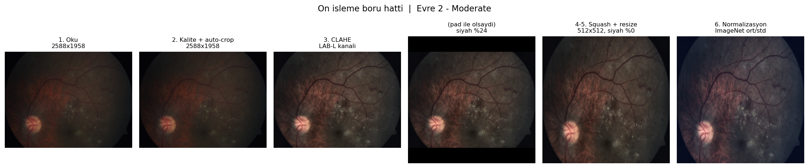
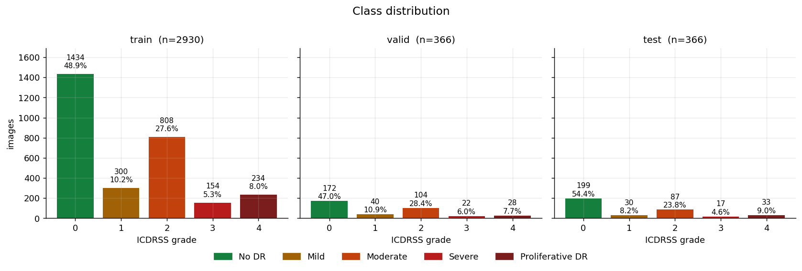
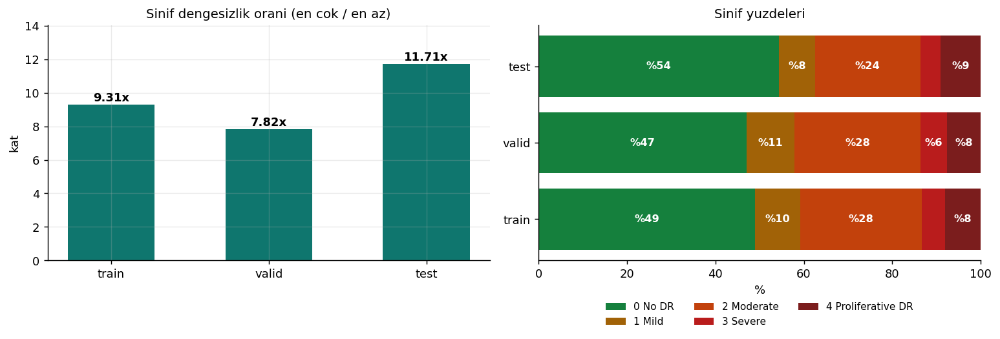
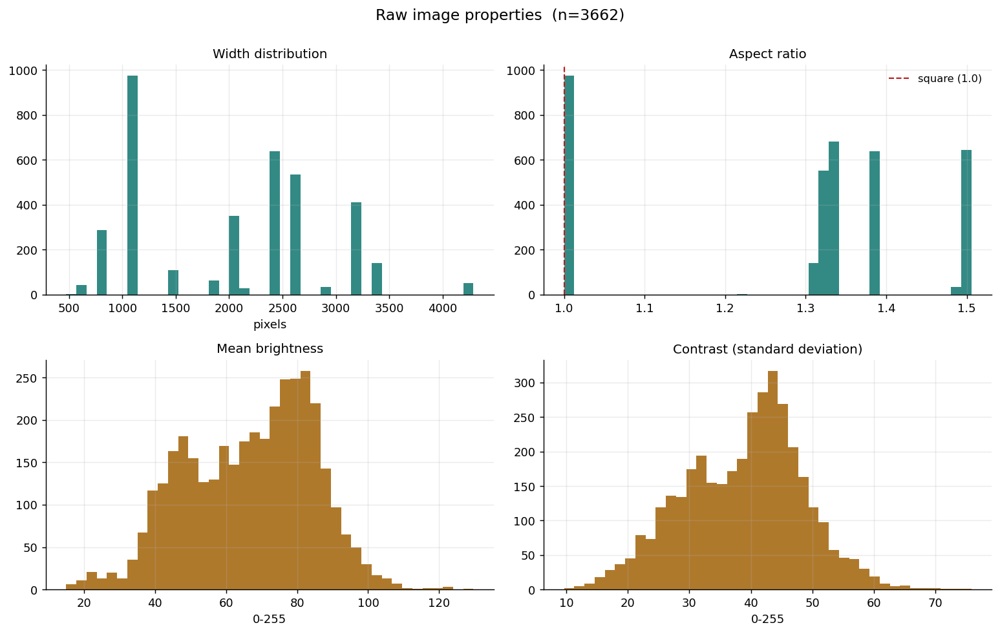

# APTOS-2019 Diyabetik Retinopati Siniflandirmasi

Data science bitirme projesi. 3662 fundus goruntusunden ICDRSS olceginde
diyabetik retinopati siddeti (0-4) tahmini.

Kaynak: Kaggle [`mariaherrerot/aptos2019`](https://www.kaggle.com/datasets/mariaherrerot/aptos2019)
— APTOS 2019 Blindness Detection verisinin train/valid/test olarak bolunmus hali.

## Mimari

| Katman | Yer |
|---|---|
| Etiketler ve sonuclar | BigQuery `datascientis.APTOS_2019` |
| Goruntuler (paylasilan) | GCS `gs://aptos2019-retina-images` |
| Goruntuler (egitim) | `data/processed*/` — 512px JPEG, yerel |

Colab ve yerel GPU ayni BigQuery ve GCS'i kullanir. Her egitim kosusu `run_id`,
`author` ve `variant` ile yazildigi icin kosular birbirini ezmez.

## Kurulum

```bash
pip install -r requirements.txt
```

GPU icin PyTorch'u **sadece** CUDA indeksinden kurun — `--extra-index-url`
eklerseniz pip PyPI'daki CPU derlemesini secer:

```bash
pip install --force-reinstall torch torchvision --index-url https://download.pytorch.org/whl/cu128
```

Kimlik dogrulama:

```bash
export GOOGLE_APPLICATION_CREDENTIALS=/yol/servis-hesabi.json
```

## Boru hatti

```bash
# 1. Ham veri
kaggle datasets download mariaherrerot/aptos2019 -p data/images --unzip

# 2. Etiketler -> BigQuery
python scripts/prepare_bq_csv.py
python scripts/load_to_bigquery.py --project datascientis --dataset APTOS_2019 \
       --location EU --prefix aptos_

# 3. Goruntu ozelliklerini tara -> BigQuery
python scripts/scan_images.py

# 4. Raporlar: goruntu ozellikleri, veri kalitesi, duplicate analizi
python scripts/image_report.py
python scripts/quality_report.py

# 5. Goruntuleri hazirla
python scripts/preprocess_images.py --size 512              # CLAHE'li
python scripts/preprocess_images.py --size 512 --no-clahe   # kontrol grubu

# 6. Gorseller ve kisayol analizi
python scripts/make_figures.py
python scripts/confound_analysis.py

# 7. Egit
python scripts/train.py --mode reg --epochs 30 --patience 5 \
       --data-dir data/processed_clahe --variant clahe

# 8. Kosulari karsilastir
python scripts/analyze_runs.py
```

## On isleme

Ortak fonksiyonlar `scripts/preprocessing.py` icinde; diger scriptler bunu
import eder, kopyalamaz.

```
Oku -> Kalite Kontrolu -> Auto-Crop -> CLAHE -> Kare -> Resize -> Normalization
```



| fonksiyon | ne yapar |
|---|---|
| `auto_crop()` | Retina disindaki siyah cerceveyi keser (ortalama %10.4 alan kazanci) |
| `apply_clahe()` | LAB uzayinda yalnizca L kanalina CLAHE — renk dengesini bozmadan damarlari belirginlestirir |
| `image_quality()` | Parlaklik/kontrast olculeri, asiri karanlik ve asiri parlak tespiti |
| `dhash()` | Algisal hash — duplicate tespitinde aday ureteci |
| `preprocess()` | Alti asamayi sirayla uygulayan tam boru hatti |

**Sira onemli.** CLAHE `auto_crop`'tan sonra cagrilmalidir; siyah cerceve
kirpilmadan uygulanirsa histogram o genis siyah alan yuzunden bozulur.
Normalizasyon boru hattinda degil, egitimdeki torchvision donusumlerinde yapilir
— iki yerde birden normalize etmemek icin bilincli bir ayrim.

## Veri

3662 goruntu, hepsi okunabilir, hepsi 3 kanalli RGB.



Sinif dagilimi cok dengesiz — train'de No DR 1434, Severe 154 (9.3 kat):



Cozunurlukler cok degisken: 474x358 ile 4288x2848 arasinda 17 farkli boyut. En
sik goruleni 1050x1050 (974 goruntu).



Goruntu ozellikleri ozeti: [`reports/image_properties.md`](reports/image_properties.md).
Ayrintili kalite raporu: [`reports/data_quality.md`](reports/data_quality.md).
Problemli goruntu listesi: [`reports/problem_images.csv`](reports/problem_images.csv).

## Metrik secimi

Asil metrik **quadratic weighted kappa (QWK)**, accuracy degil. Veri setinin
%49'u "No DR"; hicbir sey ogrenmeyen "hep 0 tahmin et" modeli %49 accuracy alir
ama QWK'da 0 alir. Yarismanin resmi metrigi de buydu.

Problem **ordinal**: 0-4 sirali bir siddet olcegi. Severe'i Mild sanmak,
Severe'i Proliferative sanmaktan daha agir bir hata. `train.py` iki yaklasimi
destekler:

- `--mode cls` — 5 sinifli softmax, sinif agirlikli cross-entropy
- `--mode reg` — tek cikisli regresyon, esikler valid uzerinde optimize edilir

Accuracy ve macro F1 de raporlanir. QWK ile macro F1'i birlikte okumak sart:
QWK komsu hatalari hafif cezalandirdigi icin, azinlik siniflarindaki zayiflik
yalnizca macro F1'de gorunur.

## Testler

```bash
python tests/test_preprocessing.py    # pytest gerekmez
```

Sentetik goruntuler kullanir, veri seti indirilmemis makinede de calisir.

## Bilinmesi gerekenler

- **Meta-veri kisayolu var.** Yalnizca dosya ozelliklerinden egitilen bir model,
  retinaya hic bakmadan QWK 0.652 aliyor (1050x1050 goruntulerin %92.5'i No DR).
  Rapor edilen skorlar bu tabanla birlikte okunmali. Ayrinti:
  [`reports/confounds_and_noise.md`](reports/confounds_and_noise.md).
- **Etiket gurultusu ~%16.** Duplicate ciftlerin %29.1'inde etiketler celisiyor;
  tek etiketin dogru olma tahmini ~%84. Model bu tavana yakin.
- **Islenmis klasorlerde `_manifest.json` var.** Hangi ayarlarla uretildigini
  kaydeder; `train.py` bunu okuyup basar.

- **Duplicate goruntuler var.** 131 dogrulanmis grup, 48'i split'ler arasi.
  Test goruntulerinin %6'sinin egitimde bir kopyasi var. Olculdu: bu kopyalarin
  cikarilmasi test QWK'sini 0.8960'tan 0.8983'e tasiyor, yani skoru sismemis —
  ama yine de duzeltilmesi gereken bir kusur.
- **37 grupta ayni goruntu farkli etiketle isaretli.** Etiket gurultusu; modelin
  hatalarinin bir kismi buradan gelebilir.
- **Parlaklik esikleri hicbir goruntuyu elemedi.** Aralik 15.0-129.6; hicbir
  goruntu 240 esigine yaklasmiyor. Yuzdelik tabanli esikler daha anlamli olur.
- **Kaggle arsivinde klasor adi tutarsiz:** valid split'i `val_images/` altinda,
  `valid_images/` degil. GCS bucket'inda ise `aptos_valid_images/`.
- **`test.csv` sonunda ~500 bos satir var.** `prepare_bq_csv.py` bunlari duser;
  autodetect ile ham yuklerseniz tablo bozulur.
- **`test` split'i 366 satir.** Model secimini `valid` uzerinde yapin, `test`'e
  sadece en sonda bir kez bakin.
- **Servis hesabi anahtarini commit etmeyin.** `.gitignore` `*.json` iceriyor.

## Dizin yapisi

```
scripts/
  preprocessing.py       ortak on isleme fonksiyonlari
  prepare_bq_csv.py      etiket CSV'lerini temizler ve zenginlestirir
  load_to_bigquery.py    etiketleri BigQuery'ye yukler
  scan_images.py         goruntu ozelliklerini tarar -> BigQuery
  image_report.py        goruntu ozellikleri ozeti
  quality_report.py      kalite raporu + duplicate analizi
  preprocess_images.py   goruntuleri egitime hazirlar
  make_figures.py        rapor gorselleri
  train.py               egitim + degerlendirme -> BigQuery
  confound_analysis.py   kisayol ozelligi ve etiket gurultusu analizi
  analyze_runs.py        kosu karsilastirmasi ve hata analizi

tests/
  test_preprocessing.py  ortak modulun 31 testi (sentetik goruntulerle)

reports/
  data_quality.md        veri kalite raporu
  problem_images.csv     problemli goruntu listesi
  figures/               14 gorsel

data/                    surum kontrolu disinda (yeniden uretilebilir)
models/                  surum kontrolu disinda
```
